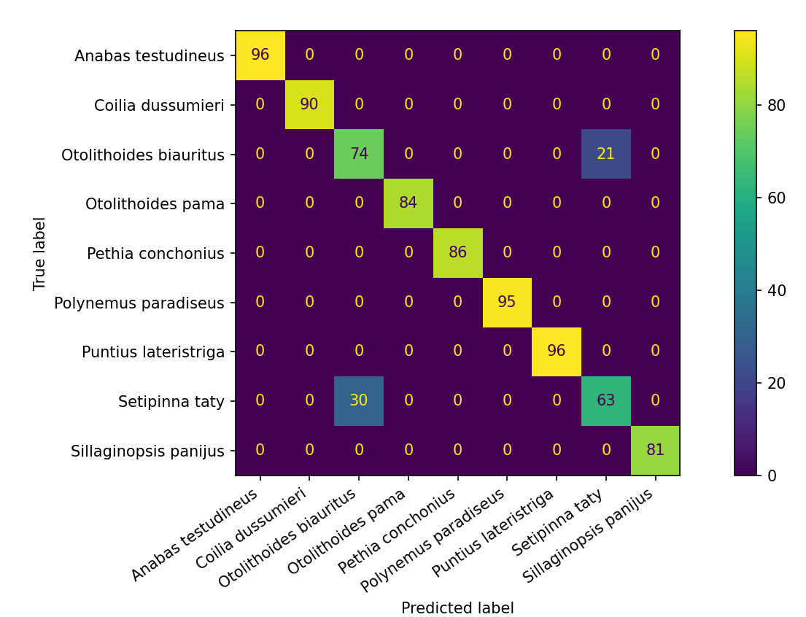

# Modelo de Classificação - Machine Learning

## Este repositório contém a implementação de algoritmos de machine learning focados na classificação de espécies de peixes com base em atributos físicos como comprimento e peso. 

#### Utilizando Redes Neurais Artificiais (RNA), juntamente com outros algoritmos de classificação, o projeto busca:

* Analisar o desempenho de diferentes modelos em termos de acurácia e precisão.
* Implementar métricas de avaliação para medir o impacto das predições.
* Comparar e ajustar hiperparâmetros dos modelos de machine learning para obter melhores resultados.
* Demonstrar o uso de validação cruzada para garantir que os modelos generalizem bem para novos dados.

#### Fase 1

Nesta primeira etapa, implementamos um modelo de Rede Neural Artificial (MLPClassifier) utilizando o algoritmo MLPClassifier da biblioteca Scikit-learn. O objetivo é classificar diferentes espécies de peixes com base em dois atributos fornecidos: comprimento (length) e peso (weight). A base de dados usada contém amostras com diversas espécies de peixes, e as espécies foram mapeadas para valores numéricos para facilitar a entrada no modelo.

**1. Pré-processamento de Dados**
* Leitura da base de dados.
* Mapeamento das espécies para valores numéricos.
* Definição das features (variáveis preditoras) como comprimento e peso.

**2. Divisão dos Dados**
* Divisão dos dados em conjuntos de treinamento e teste, sendo 80% para treinamento e 20% para teste.
  
**3. Criação e treinamento do modelo**
* Um classificador MLP com um máximo de 2000 iterações foi instanciado.
* O modelo foi treinado com os dados de treinamento.

**4. Avaliação do modelo**
* O modelo foi testado com os dados de teste, e a acurácia foi medida.
* Foi gerada uma matriz de confusão para analisar visualmente a performance do modelo.

**Resultados obtidos**
* Acurácia: 94%
* Matriz de confusão:
 

#### Fase 2

