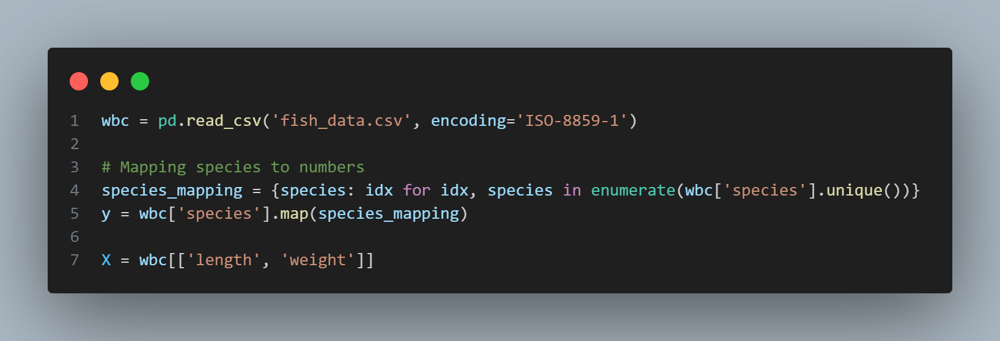
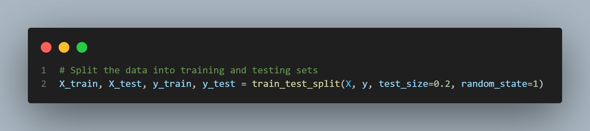
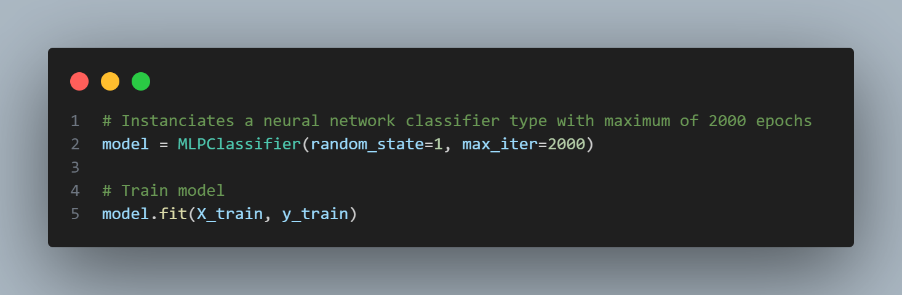
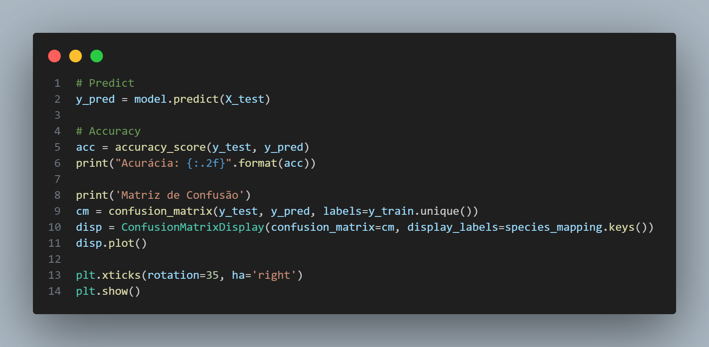
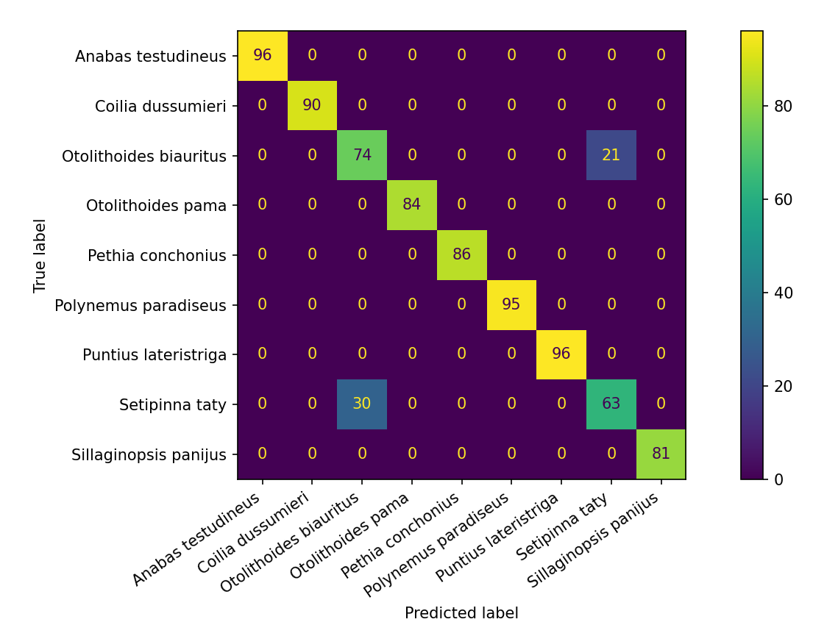
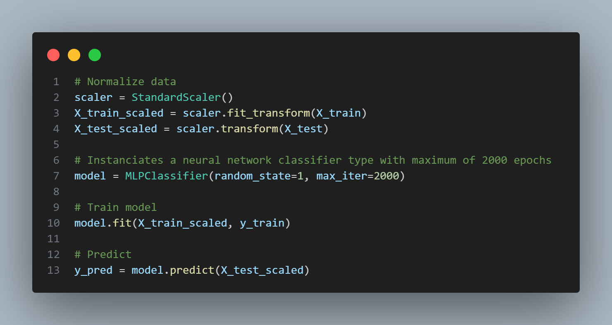
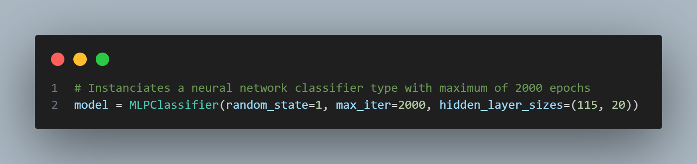
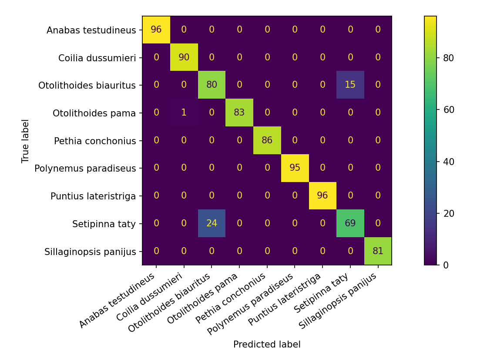

# Modelo de Classificação - Machine Learning

**Este repositório contém a implementação de algoritmos de machine learning focados na classificação de espécies de peixes com base em atributos físicos como comprimento e peso.**
* Utilizamos uma base de dados disponível no kaggles: https://www.kaggle.com/datasets/taweilo/fish-species-sampling-weight-and-height-data
* Esta base de dados trás os atributos Species, length e weight.
* **Variável alvo(target):** Utilizamos o atributo **"species"** como target, que serão as entradas que o modelo irá prever.
* **Variáveis preditoras(features):** As entradas que o modelo usa para fazer as previsões são **"lenght e weight"**.  

#### Utilizando Redes Neurais Artificiais (RNA), juntamente com outros algoritmos de classificação, o projeto busca:

* Analisar o desempenho de diferentes modelos em termos de acurácia e precisão.
* Implementar métricas de avaliação para medir o impacto das predições.
* Comparar e ajustar hiperparâmetros dos modelos de machine learning para obter melhores resultados.
* Demonstrar o uso de validação cruzada para garantir que os modelos generalizem bem para novos dados.

#### Fase 1

Nesta primeira etapa, implementamos um modelo de Rede Neural Artificial (MLPClassifier) utilizando o algoritmo MLPClassifier da biblioteca Scikit-learn. O objetivo é classificar diferentes espécies de peixes com base em dois atributos fornecidos: comprimento (length) e peso (weight). A base de dados usada contém amostras com diversas espécies de peixes, e as espécies foram mapeadas para valores numéricos para facilitar a entrada no modelo.

**1. Pré-processamento de Dados**
* Leitura da base de dados.
* Mapeamento das espécies para valores numéricos.
* Definição das features (variáveis preditoras) como comprimento e peso.

**2. Divisão dos Dados**
* Divisão dos dados em conjuntos de treinamento e teste, sendo 80% para treinamento e 20% para teste.

  
**3. Criação e treinamento do modelo**
* Um classificador MLP com um máximo de 2000 iterações foi instanciado.
* O modelo foi treinado com os dados de treinamento.

**4. Avaliação do modelo**
* O modelo foi testado com os dados de teste, e a acurácia foi medida.
* Foi gerada uma matriz de confusão para analisar visualmente a performance do modelo.

**Resultados obtidos**
* Acurácia: 0.94
* Matriz de confusão:
 

#### Fase 2

Nesta segunda etapa, foi implementada a técnica de normalização dos dados através da classe StandardScaler da biblioteca scikit-learn. A normalização é uma etapa importante em redes neurais, pois garante que todos os atributos estejam na mesma escala, o que facilita o aprendizado do modelo e previne que as variáveis com maior amplitude dominem o processo de treinamento.
Após a aplicação da normalização, a acurácia do modelo apresentou um aumento de 0.01 em relação à versão anterior que utilizava os dados sem pré-processamento.

**Alterações feitas**
* Normalização com **StandardScaler**:

 

**Resultados obtidos**
* Acurácia: 0.95
* Matriz de confusão:

 

#### Fase 3

Para otimizar o desempenho, foi realizada uma alteração na arquitetura, utilizando agora duas camadas ocultas com 115 e 20 neurônios, respectivamente. Anteriormente, utilizávamos a configuração padrão da rede neural, onde o MLPClassifier do scikit-learn cria uma única camada oculta com 100 neurônios. Ao adicionar camadas ocultas e ajustar o número de neurônios em cada camada, buscamos encontrar um equilíbrio melhor entre capacidade de modelagem e regularização. 
Na primeira camada os 115 neurônios, um número relativamente alto, nos ajuda a garantir que o modelo tenha a capacidade de capturar relações não-lineares e características complexas presentes nos dados. 
Na segunda camada, utilizamos um número menor de neurônios para ajudar a refinar os padrões capturados pela primeira camada, agindo como um "funil".
Obtivemos uma pequena melhora na acurácia do modelo em relação à configuração padrão. As espécies que anteriormente classificava 16 e 28 erroneamente, passaram a classificar 15 e 24 erroneamente.

**Alterações feitas**
* Adicionado duas camadas ocultas:

 

**Resultados obtidos**
* Acurácia: 0.95
* Matriz de confusão:

 

