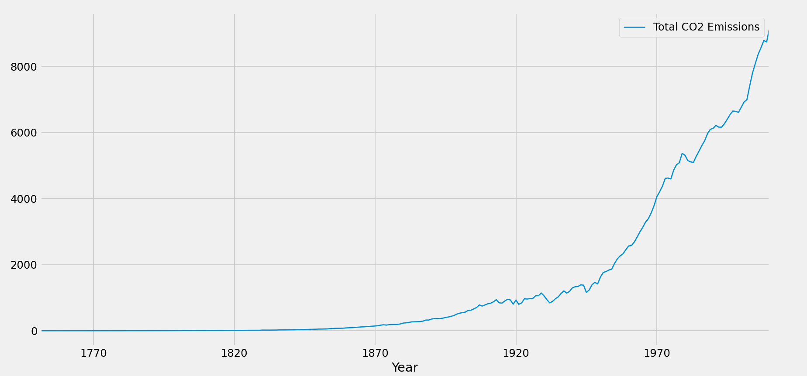
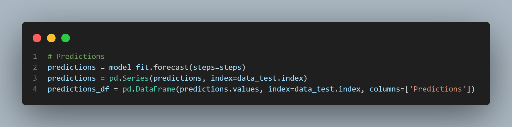

# Modelo de Séries Temporais - Machine Learning

**Este diretório contém a implementação de algoritmos de machine learning de séries focados na previsão de níveis globais de CO2 na atmosfera ao longo do tempo(1751 - 2010).**
* Utilizamos uma base de dados disponível no kaggles: https://www.kaggle.com/datasets/programmerrdai/co2-levels-globally-from-fossil-fuels
* Esta base de dados trás os atributos Year, Total, Gas Fuel, Liquid Fuel, Solid Fuel, Cement e Gas Flaring.
* **Variável alvo(target):** Utilizamos o atributo **"Total"** como a variável a ser prevista, representando as emissões de CO2 ao longo do tempo.
* **Variável temporal(feature):** O atributo **"Year"** é usado como a variável temporal que serve como base para a sequência cronológica das previsões.  

#### O projeto explora o uso de modelos de séries temporais como ARIMA e SARIMA para prever emissões futuras, visando:

* Analisar a tendência e sazonalidade das emissões de CO2 ao longo do tempo.
* Implementar técnicas de normalização e transformação para melhorar a qualidade das previsões.
* Comparar o desempenho dos modelos com diferentes combinações de parâmetros e realizar ajuste fino.
* Demonstrar o uso de métricas como RMSE (Root Mean Squared Error) para avaliar a precisão das previsões.
* Aplicar técnicas de backtesting para validar a generalização dos modelos em diferentes períodos históricos.

#### ARIMA

Nesta implementação utilizamos o modelo ARIMA (AutoRegressive Integrated Moving Average) da biblioteca Statsmodels. O objetivo é prever as emissões totais de CO₂ ao longo do tempo com base em dados históricos. O modelo ARIMA é configurado para capturar a tendência e as flutuações da série temporal, utilizando parâmetros que definem o comportamento autoregressivo, a diferenciação e o componente de média móvel.

**1. Pré-processamento de Dados**
* Leitura da base de dados.
* Conversão da coluna Year para o tipo datetime e definição dela como índice da série temporal.
* Definição da frequência anual da série para garantir consistência temporal.

**2. Análise inicial**
* Criamos um gráfico de linha para uma análise inicial, que exibe a série temporal completa das emissões de CO₂ ao longo dos anos.

**3. Divisão dos Dados**
* Divisão da série em conjuntos de treino e teste, com os últimos 30 anos de dados reservados para teste.

**4. Gráfico de Treinamento e Teste**
* Desenhamos um gráfico que nos ajuda a entender a quantidade de dados usada para treinar o modelo e a parte da série que será utilizada para avaliar as previsões.

**5. Criação do modelo**
* Instanciação do modelo ARIMA para capturar padrões temporais nos dados de treino.
* Utilizamos os parâmetros (5,2,1) (comportamento autoregressivo, diferenciação, componente de média móvel).Cx

**6. Previsão**
* Geração de previsões com o modelo ARIMA para o período de teste.
* As previsões são geradas diretamente na escala original dos dados, permitindo comparação direta com os valores reais de emissões de CO₂.

**7. Avaliação do modelo**
* Comparação visual entre os valores reais e as previsões do modelo no conjunto de teste.
* Gráfico final exibindo os dados de treino, teste e as previsões para avaliação do desempenho do modelo.

#### SARIMA

Testamos também o modelo SARIMA (Seasonal AutoRegressive Integrated Moving Average) da biblioteca Statsmodels. O SARIMA é uma extensão do ARIMA que inclui componentes sazonais, sendo ideal para séries temporais que apresentam padrões repetitivos ao longo de intervalos regulares. Esse modelo é configurado para capturar tanto a tendência quanto as flutuações sazonais nas emissões totais de CO₂. Ajustamos algumas partes com base na implementação anterior para podermos utilizar o SARIMA.

**1. Transformação Logarítmica**
* Diferente do modelo anterior, aplicamos uma transformação logarítmica nas séries de treinamento e teste antes do ajuste do modelo.
* Essa transformação visa suavizar a série, reduzindo a variabilidade e permitindo que o modelo capture melhor as tendências e padrões sazonais.

**2. Treinamento do Modelo com SARIMA**
* O SARIMA introduz componentes sazonais, permitindo modelar padrões que se repetem em intervalos regulares. 
* Neste caso, foram definidos parâmetros sazonais (P, D, Q, S) que capturam a sazonalidade anual na série de emissões de CO₂.
* Utilizamos os parâmetros sazonais (1,1,1,10).

**3. Previsão e Reversão da Transformação**
* As previsões geradas pelo SARIMA são inicialmente logarítmicas.
* Para converter as previsões de volta à escala original, aplicamos a função exponencial inversa (np.exp).
* Esse passo garante que as previsões estejam na mesma escala dos dados reais de emissões.

#### CONCLUSÃO

O modelo ARIMA apresenta uma tendência geral de previsão precisa, porém, ele não considera sazonalidades explícitas nos dados. Isso pode resultar em previsões adequadas para séries que exibem tendências de longo prazo sem flutuações sazonais marcantes.
Já o modelo SARIMA mostra previsões que se ajustam com maior precisão às oscilações dos dados. Esse modelo é particularmente útil para séries temporais que apresentam sazonalidade, pois considera tanto o padrão de tendência quanto a repetição cíclica dos dados, aprimorando a capacidade de previsão em períodos onde essas flutuações são significativas.
